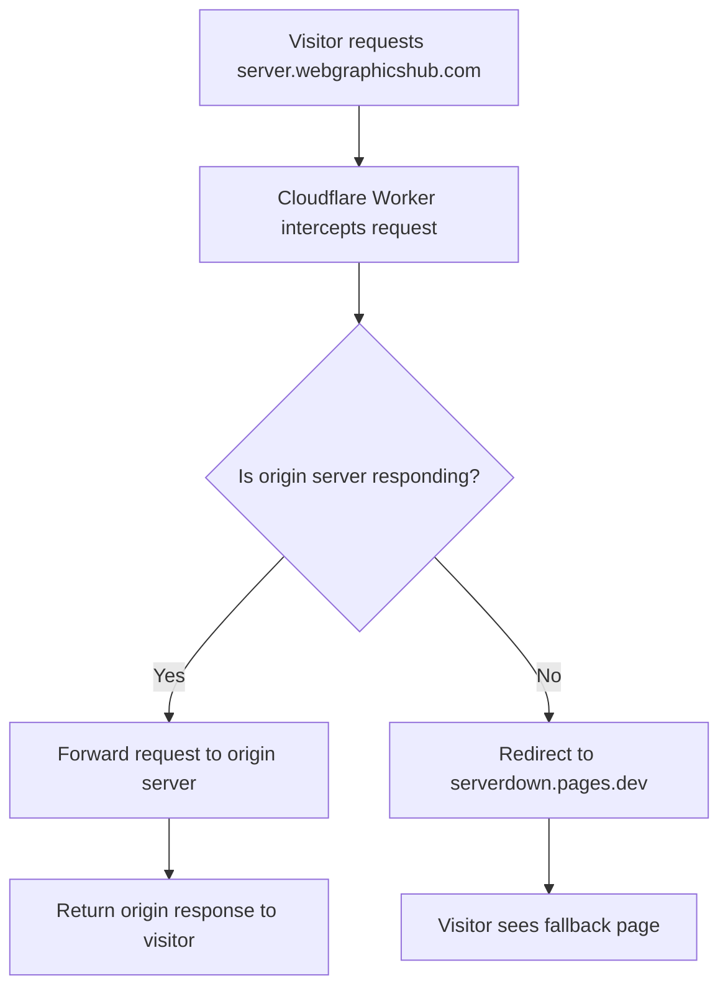

# Cloudflare Worker Guide: Redirect to Fallback When Server is Down

## Overview

This guide will help you set up a Cloudflare Worker to automatically redirect visitors from your Cloudflare Tunnel subdomains (`server.webgraphicshub.com` and `dev.webgraphicshub.com`) to a fallback URL (`https://serverdown.pages.dev/`) when your origin server is down.

**Problem:** When your server is shut down, visitors see the Cloudflare Tunnel Error 1033 page.

**Solution:** A Cloudflare Worker will intercept requests, check if the origin server is available, and redirect to your custom fallback page when it's down.

---

## Table of Contents

1. [Prerequisites](#prerequisites)
2. [Understanding the Solution](#understanding-the-solution)
3. [Step-by-Step Implementation](#step-by-step-implementation)
4. [Worker Code Explanation](#worker-code-explanation)
5. [Testing Your Setup](#testing-your-setup)
6. [Troubleshooting](#troubleshooting)
7. [Advanced Configuration](#advanced-configuration)

---

## Prerequisites

Before you begin, ensure you have:

- ✅ A Cloudflare account with your domain (`webgraphicshub.com`) added
- ✅ DNS managed by Cloudflare for your domain
- ✅ Two subdomains configured with Cloudflare Tunnel:
  - `server.webgraphicshub.com`
  - `dev.webgraphicshub.com`
- ✅ A fallback page hosted at `https://serverdown.pages.dev/`
- ✅ Basic understanding of JavaScript (helpful but not required)

---

## Understanding the Solution

### How Cloudflare Workers Work

Cloudflare Workers are serverless functions that run on Cloudflare's edge network, intercepting HTTP requests before they reach your origin server. They can:

- Modify requests and responses
- Make decisions based on request properties
- Redirect users to different URLs
- Handle errors gracefully

### The Workflow



### Why This Approach Works

1. **Edge-level detection**: The Worker runs at Cloudflare's edge, detecting server issues before visitors see error pages
2. **Automatic failover**: No manual intervention needed when your server goes down
3. **Seamless experience**: Visitors see your custom fallback page instead of generic error messages
4. **Zero downtime setup**: The Worker can be deployed without affecting current traffic

---

## Step-by-Step Implementation

### Step 1: Access Cloudflare Workers Dashboard

1. Log in to your [Cloudflare Dashboard](https://dash.cloudflare.com/)
2. Select your domain `webgraphicshub.com` from the list
3. In the left sidebar, click on **Workers & Pages**
4. Click the **Create application** button
5. Select the **Create Worker** tab
6. Click **Start with Hello World!**

> [!TIP]
> If you don't see the "Workers & Pages" option, ensure your account has Workers enabled. Free tier accounts get 100,000 requests per day.

---

### Step 2: Name and Deploy Your Worker

1. You'll see a "Hello World" template with default code
2. At the top, change the worker name from the random name (e.g., `purple-waterfall-1234`) to something meaningful like: **`server-fallback-redirect`**
3. Click **Deploy** to create the worker with the default "Hello World" code (we'll replace it in the next step)

> [!NOTE]
> The worker name is only for your reference in the dashboard. It doesn't affect functionality.

---

### Step 3: Edit Worker Code

1. After deployment, click **Edit code** button
2. You'll see the Cloudflare Workers code editor with default code
3. **Delete all the existing code**
4. **Copy and paste the following code:**

```javascript
export default {
  async fetch(request, env, ctx) {
    const url = new URL(request.url);
    const hostname = url.hostname;
    
    // Only apply this worker to specific subdomains
    const targetSubdomains = [
      'server.webgraphicshub.com',
      'dev.webgraphicshub.com'
    ];
    
    // If this request is not for our target subdomains, pass through
    if (!targetSubdomains.includes(hostname)) {
      return fetch(request);
    }
    
    // Fallback URL when server is down
    const fallbackUrl = 'https://serverdown.pages.dev/';
    
    try {
      // Attempt to fetch from the origin server
      const response = await fetch(request, {
        // Set a timeout to detect if server is down faster
        signal: AbortSignal.timeout(10000) // 10 second timeout
      });
      
      // Check if we got a Cloudflare Tunnel error (1033)
      // or other server errors (5xx status codes)
      if (response.status >= 500 || response.status === 1033) {
        console.log(`Server error detected: ${response.status}`);
        return Response.redirect(fallbackUrl, 302);
      }
      
      // Check for Cloudflare error page by looking at response headers
      const cfRay = response.headers.get('cf-ray');
      const server = response.headers.get('server');
      
      // If it's a Cloudflare error page (not from origin)
      if (server === 'cloudflare' && response.status >= 500) {
        console.log('Cloudflare error page detected');
        return Response.redirect(fallbackUrl, 302);
      }
      
      // Server is up and responding normally
      return response;
      
    } catch (error) {
      // Network error, timeout, or connection refused
      console.log(`Error connecting to origin: ${error.message}`);
      return Response.redirect(fallbackUrl, 302);
    }
  }
};
```

5. Click **Save and Deploy** in the top-right corner

---

### Step 4: Configure Worker Routes

Now you need to tell Cloudflare which domains should use this Worker.

1. After deploying your worker, you'll be on the worker's page
2. Click on the **Settings** tab at the top
3. Scroll down to the **Domains & Routes** section
4. Click the **Add** button (blue "+ Add" link on the right)
5. A sidebar will open on the right - click on **Route**

#### Add Route for server.webgraphicshub.com

1. In the Route configuration:
   - **Route:** `server.webgraphicshub.com/*`
   - **Zone:** Select `webgraphicshub.com` from the dropdown
2. Click **Add Route** or **Save**

#### Add Route for dev.webgraphicshub.com

1. Click the **Add** button again in the **Domains & Routes** section
2. Click on **Route**
3. In the Route configuration:
   - **Route:** `dev.webgraphicshub.com/*`
   - **Zone:** Select `webgraphicshub.com` from the dropdown
4. Click **Add Route** or **Save**

> [!IMPORTANT]
> The `/*` wildcard ensures the Worker handles all paths on these subdomains, not just the homepage. For example, both `server.webgraphicshub.com/` and `server.webgraphicshub.com/admin/login` will be handled by the Worker.

---

### Step 5: Verify Configuration

Your **Domains & Routes** section should now show:

| Type | Value | Status |
|------|-------|--------|
| Route | `server.webgraphicshub.com/*` | Active |
| Route | `dev.webgraphicshub.com/*` | Active |

You may also see a **Preview URLs** section showing an inactive preview URL like `*.wgh-server-fallback-redirect.webgraphicshub.workers.dev` - this is normal and can be ignored.

---

## Worker Code Explanation

Let's break down what the Worker code does:

### 1. Request Interception

```javascript
async fetch(request, env, ctx) {
  const url = new URL(request.url);
  const hostname = url.hostname;
```

- Every request to your subdomains is intercepted
- We extract the hostname to identify which subdomain is being accessed

### 2. Subdomain Filtering

```javascript
const targetSubdomains = [
  'server.webgraphicshub.com',
  'dev.webgraphicshub.com'
];

if (!targetSubdomains.includes(hostname)) {
  return fetch(request);
}
```

- Only applies logic to specified subdomains
- Other domains/subdomains pass through unchanged
- Makes the Worker safe to use on your entire zone

### 3. Origin Server Check

```javascript
const response = await fetch(request, {
  signal: AbortSignal.timeout(10000) // 10 second timeout
});
```

- Attempts to connect to your origin server
- 10-second timeout prevents long waits
- If server doesn't respond in time, triggers the catch block

### 4. Error Detection

```javascript
if (response.status >= 500 || response.status === 1033) {
  return Response.redirect(fallbackUrl, 302);
}
```

- Checks for HTTP 5xx errors (server errors)
- Checks for Cloudflare Tunnel error 1033
- Redirects to fallback page with 302 (temporary redirect)

### 5. Cloudflare Error Page Detection

```javascript
if (server === 'cloudflare' && response.status >= 500) {
  return Response.redirect(fallbackUrl, 302);
}
```

- Detects if the response is from Cloudflare's error page (not your server)
- Ensures generic Cloudflare errors also trigger the redirect

### 6. Exception Handling

```javascript
catch (error) {
  console.log(`Error connecting to origin: ${error.message}`);
  return Response.redirect(fallbackUrl, 302);
}
```

- Catches network errors, timeouts, connection refused
- Logs the error for debugging
- Redirects to fallback page

---

## Testing Your Setup

### Test 1: Server Running (Normal Operation)

1. Ensure your server is **running**
2. Visit `https://server.webgraphicshub.com/`
3. **Expected Result:** Your normal website loads
4. Visit `https://dev.webgraphicshub.com/`
5. **Expected Result:** Your dev site loads normally

✅ **Success:** The Worker passes requests through to your origin server when it's available.

---

### Test 2: Server Down (Fallback Activation)

1. **Shut down your server** or stop the Cloudflare Tunnel service
2. Wait 30-60 seconds for the tunnel to fully disconnect
3. Visit `https://server.webgraphicshub.com/`
4. **Expected Result:** You're redirected to `https://serverdown.pages.dev/`
5. Visit `https://dev.webgraphicshub.com/`
6. **Expected Result:** You're redirected to `https://serverdown.pages.dev/`

✅ **Success:** The Worker detects the server is down and redirects to your fallback page.

---

### Test 3: Check Worker Logs

1. Go to your Cloudflare Dashboard
2. Navigate to **Workers & Pages** → Your worker
3. Click on **Logs** tab (if available) or use **Real-time Logs**
4. Trigger some requests and observe the logs
5. Look for console.log messages indicating server status

> [!NOTE]
> Free tier accounts have limited logging. Consider upgrading for detailed analytics.

---

## Troubleshooting

### Issue: Worker Not Triggering

**Symptoms:** Still seeing Cloudflare Error 1033 page

**Solutions:**
1. ✅ Verify routes are correctly configured in **Domains & Routes** section
2. ✅ Ensure routes include `/*` wildcard
3. ✅ Check that the zone is set to `webgraphicshub.com`
4. ✅ Wait 1-2 minutes for changes to propagate globally
5. ✅ Clear your browser cache and try in incognito mode

---

### Issue: Infinite Redirects

**Symptoms:** Browser shows "Too many redirects" error

**Solutions:**
1. ✅ Ensure `fallbackUrl` is NOT one of your target subdomains
2. ✅ Verify the fallback URL (`serverdown.pages.dev`) is accessible
3. ✅ Check that you're not running another Worker or Page Rule that conflicts

---

### Issue: Slow Response Times

**Symptoms:** Pages take longer to load than before

**Solutions:**
1. ✅ Reduce the timeout from 10000ms to 5000ms (5 seconds)
2. ✅ Consider using Cloudflare's Health Checks instead (see Advanced Configuration)
3. ✅ Optimize your origin server response times

---

### Issue: Worker Not Detecting Server Down

**Symptoms:** Still seeing error pages instead of redirect

**Solutions:**
1. ✅ Increase the timeout value if your server is slow to respond
2. ✅ Check Worker logs to see what status codes are being returned
3. ✅ Add more specific error detection:

```javascript
// Add this check
if (response.status === 502 || response.status === 503 || response.status === 504) {
  return Response.redirect(fallbackUrl, 302);
}
```

---

## Advanced Configuration

### 1. Custom Fallback Pages Per Subdomain

If you want different fallback pages for each subdomain:

```javascript
const fallbackUrls = {
  'server.webgraphicshub.com': 'https://serverdown.pages.dev/server',
  'dev.webgraphicshub.com': 'https://serverdown.pages.dev/dev'
};

const fallbackUrl = fallbackUrls[hostname] || 'https://serverdown.pages.dev/';
```

---

### 2. Add Retry Logic

Retry the origin request before redirecting:

```javascript
let retries = 2;
let response;

for (let i = 0; i <= retries; i++) {
  try {
    response = await fetch(request, {
      signal: AbortSignal.timeout(5000)
    });
    
    if (response.status < 500) break; // Success, exit retry loop
    
    if (i < retries) {
      await new Promise(resolve => setTimeout(resolve, 1000)); // Wait 1s before retry
    }
  } catch (error) {
    if (i === retries) {
      return Response.redirect(fallbackUrl, 302);
    }
  }
}
```

---

### 3. Add Custom Headers

Track which requests were redirected:

```javascript
return Response.redirect(fallbackUrl, 302, {
  headers: {
    'X-Fallback-Triggered': 'true',
    'X-Original-Host': hostname
  }
});
```

---

### 4. Maintenance Mode Toggle

Use environment variables to enable/disable fallback:

```javascript
// In Worker Settings > Variables and Secrets, add: MAINTENANCE_MODE = "true"

if (env.MAINTENANCE_MODE === "true") {
  return Response.redirect(fallbackUrl, 302);
}
```

Then toggle maintenance mode from the dashboard without editing code.

---

### 5. Geographic Routing

Redirect only users from specific regions:

```javascript
const country = request.cf.country; // Cloudflare provides this

if (country === 'US' && serverDown) {
  return Response.redirect('https://us-fallback.pages.dev/', 302);
} else if (serverDown) {
  return Response.redirect('https://global-fallback.pages.dev/', 302);
}
```

---

### 6. Scheduled Health Checks

Use Cloudflare's Cron Triggers to periodically check server health:

```javascript
export default {
  async fetch(request, env, ctx) {
    // ... existing code ...
  },
  
  async scheduled(event, env, ctx) {
    // Runs on schedule (e.g., every 5 minutes)
    const health = await fetch('https://server.webgraphicshub.com/health');
    
    if (!health.ok) {
      // Send notification, update KV storage, etc.
      await env.KV.put('SERVER_STATUS', 'down');
    } else {
      await env.KV.put('SERVER_STATUS', 'up');
    }
  }
};
```

Configure the schedule in Worker settings:
- Cron expression: `*/5 * * * *` (every 5 minutes)

---

## Best Practices

### 1. Use 302 (Temporary) Redirects

```javascript
Response.redirect(fallbackUrl, 302); // Temporary
```

- ✅ **Use 302:** Tells search engines this is temporary
- ❌ **Avoid 301:** Permanent redirects can hurt SEO

### 2. Monitor Worker Performance

- Enable Real-time Logs in the Cloudflare dashboard
- Set up alerts for high error rates
- Review analytics weekly

### 3. Keep Fallback Page Simple

Your `serverdown.pages.dev` page should:
- Load quickly (minimal assets)
- Clearly communicate the issue
- Provide estimated return time
- Include contact information
- Be mobile-friendly

### 4. Test Regularly

- Test failover monthly
- Verify both subdomains
- Check from different geographic locations
- Test on mobile and desktop

### 5. Document Your Setup

Keep a record of:
- Worker code version
- Route configurations
- Timeout values
- Last tested date

---

## Security Considerations

### 1. Prevent DDoS Amplification

```javascript
// Limit redirects to prevent abuse
const redirectCount = parseInt(request.headers.get('X-Redirect-Count') || '0');

if (redirectCount > 3) {
  return new Response('Too many redirects', { status: 508 });
}
```

### 2. Validate Fallback URL

```javascript
const allowedFallbacks = [
  'https://serverdown.pages.dev/',
  'https://maintenance.webgraphicshub.com/'
];

if (!allowedFallbacks.includes(fallbackUrl)) {
  throw new Error('Invalid fallback URL');
}
```

### 3. Rate Limiting

Use Cloudflare's Rate Limiting rules to prevent abuse of your Worker.

---

## Cost Considerations

### Cloudflare Workers Pricing (as of 2024)

| Plan | Requests/Day | Price |
|------|--------------|-------|
| **Free** | 100,000 | $0 |
| **Paid** | 10,000,000 | $5/month |

### Estimating Your Usage

- Average website: 1,000-10,000 requests/day
- High-traffic site: 50,000-100,000 requests/day

> [!TIP]
> The free tier is sufficient for most small to medium websites. Monitor your usage in the dashboard.

---

## Frequently Asked Questions

### Q: Will this affect my site's performance?

**A:** Minimal impact. Workers add ~1-2ms of latency, which is negligible. When your server is up, the Worker simply passes requests through.

### Q: Can I use this with other Cloudflare features?

**A:** Yes! Workers are compatible with:
- Cloudflare Tunnels ✅
- Page Rules ✅
- Firewall Rules ✅
- CDN Caching ✅

### Q: What happens if Cloudflare Workers is down?

**A:** Extremely rare. Cloudflare has 99.99%+ uptime. If Workers fail, requests pass through to your origin server normally.

### Q: Can I redirect to a page on the same domain?

**A:** Yes, but be careful to avoid redirect loops. Ensure the fallback page doesn't trigger the Worker.

### Q: How do I disable the Worker temporarily?

**A:** In the Worker settings, go to **Domains & Routes** section and click the three dots (...) next to each route, then select **Delete**. Re-add them when ready to re-enable.

---

## Summary

You've successfully set up a Cloudflare Worker to:

✅ Intercept requests to `server.webgraphicshub.com` and `dev.webgraphicshub.com`  
✅ Detect when your origin server is down  
✅ Redirect visitors to `https://serverdown.pages.dev/`  
✅ Provide a seamless experience instead of error pages  

### Next Steps

1. ✅ Test the setup with your server running and stopped
2. ✅ Customize the fallback page at `serverdown.pages.dev`
3. ✅ Monitor Worker analytics in the Cloudflare dashboard
4. ✅ Consider implementing advanced features (retry logic, custom headers, etc.)

---

## Additional Resources

- [Cloudflare Workers Documentation](https://developers.cloudflare.com/workers/)
- [Cloudflare Tunnel Documentation](https://developers.cloudflare.com/cloudflare-one/connections/connect-apps/)
- [Workers Examples Repository](https://github.com/cloudflare/workers-sdk/tree/main/templates)
- [Cloudflare Community Forum](https://community.cloudflare.com/)

---

## Support

If you encounter issues:

1. Check the [Troubleshooting](#troubleshooting) section
2. Review Worker logs in the Cloudflare dashboard
3. Visit the [Cloudflare Community Forum](https://community.cloudflare.com/)
4. Contact Cloudflare Support (paid plans only)

---

**Last Updated:** December 29, 2025  
**Version:** 1.0  
**Author:** Created for webgraphicshub.com
